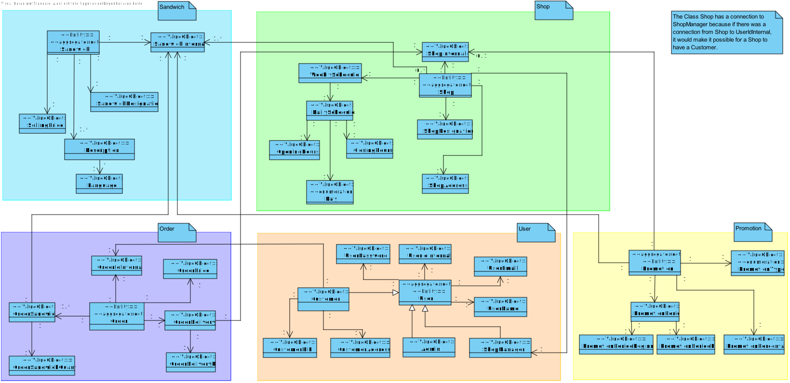
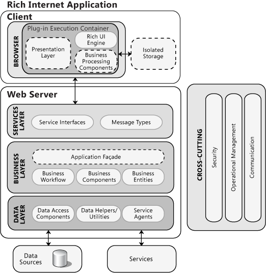
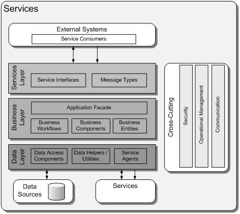
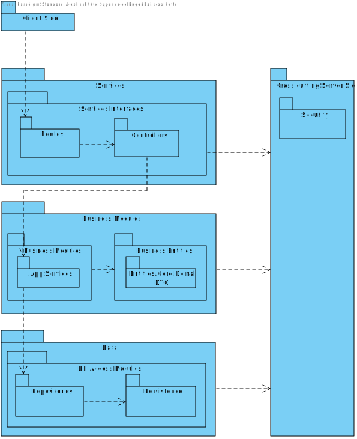
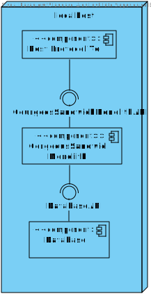
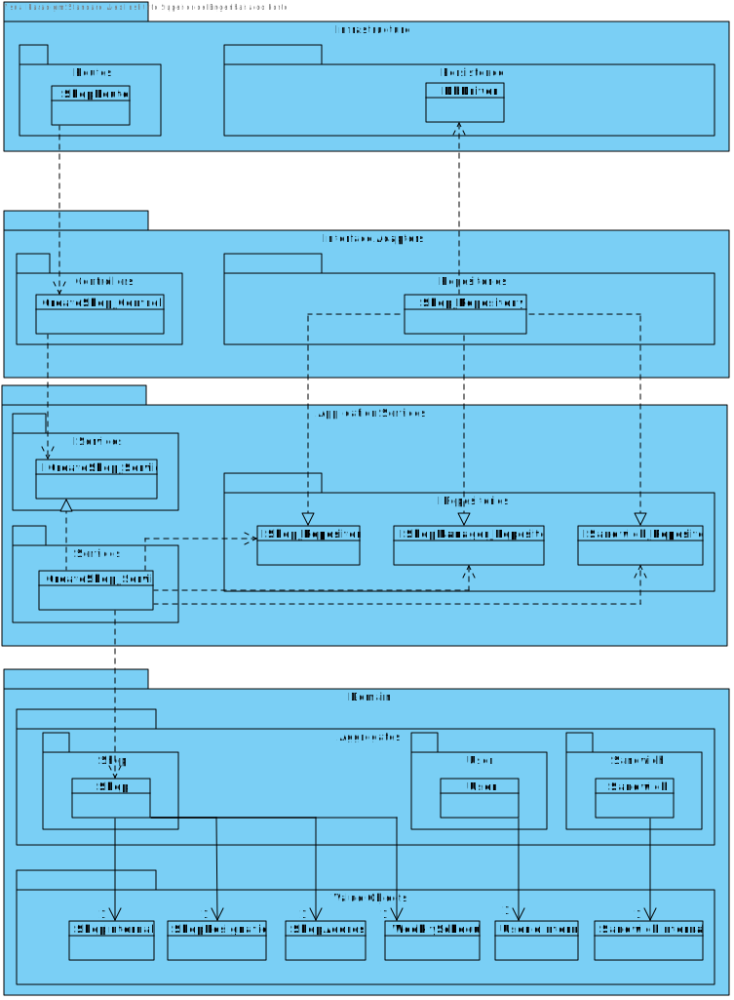
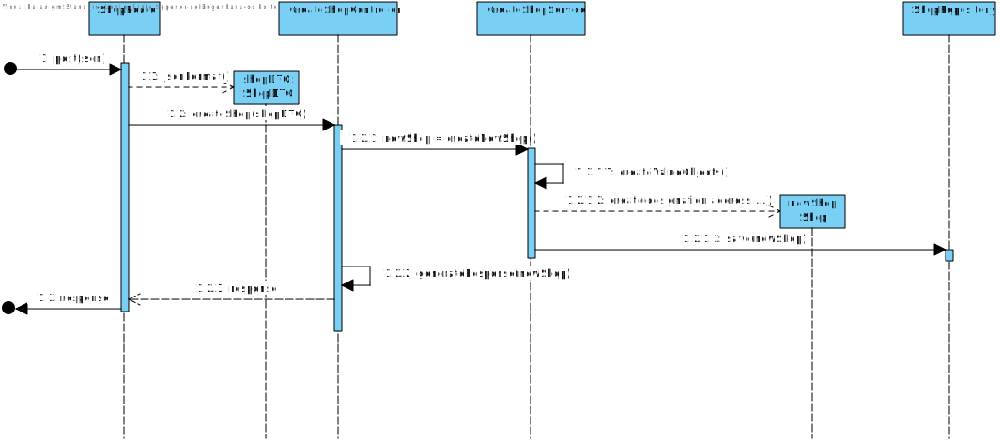
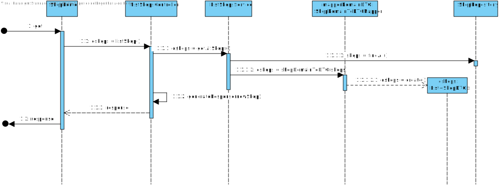
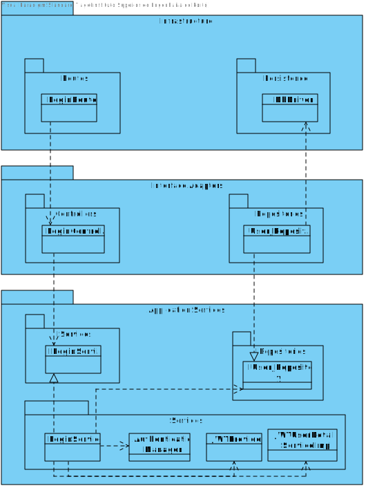
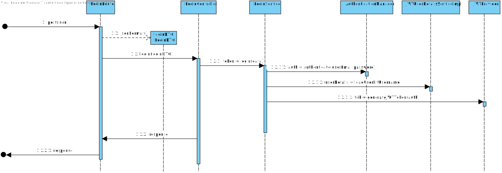

# Repository for Project 

# Part 1

### DDD

### Technologies to use

#### SpringBoot

Spring Boot is an open source Java-based framework that adheres to the inversion of control programming principle and is oriented towards the development of web based applications. It is a popular framework for developing microservices. The usage of this techonolgy was an imposed requirement.

#### JUnit

Unit tests should be implemented in the project, as a result a testing framework should be used. Since the group is familiar with JUnit, and it's the most used Java testing framework it was established that it is the framework that should be used in this project.

#### Postman

Since the application will have no frontend a tool to send requests to the app either for demonstration or for testing purposes is required. Since the group is familiarized with Postman and since it is a tool that makes available a testing framework for free, it was chosen to implement system tests.

#### Sonargraph

Sonargraph is a powerful static code analyzer that allows you to monitor a software system for technical quality and enforce rules regarding software architecture, metrics and other aspects in all stages of the development process (https://www.hello2morrow.com/products/sonargraph). The usage of this techonolgy was an imposed requirement.

#### PostgreSQL

In order to choose the best database system for the project a few considerations were made:
1. Does the database work for the project's needs?
2. Is the database integration with the project simple?
3. Are the members of the group familiar or otherwise confortable with working with this database.

Two databases were considered: MongoDB and PostgreSQL. And although both were deemed suitable the group decided to use PostgreSQL due to:
1. The expected data has a defined structure so a relational database was preferable.
2. Using the JPA framework the database integration is trivialized in terms of complexity.
3. The majority of the members have already worked with postgreSQL and the remaining members have worked with databases with a similar syntax.

#### Technology 6 (If necessary in retrospect)

-

### Drivers

#### Use Cases

| Use Case                             | Description                                                                                                                                                                                                                                                                                                                                                                                                                                  |
|--------------------------------------|----------------------------------------------------------------------------------------------------------------------------------------------------------------------------------------------------------------------------------------------------------------------------------------------------------------------------------------------------------------------------------------------------------------------------------------------|
| UC1- List sandwiches.                | See all sandwiches and it's ingredients.                                                                                                                                                                                                                                                                                                                                                                                                     |
| UC2- Create an order.                | A costumer must be able to register sandwiches and their quantities to deliver on a specific day, on a specific shop. A sandwich can never be sold below zero and the promotions used should be possible to  be changed within seconds without afecting what was selected. Also promotions are reflected in the price according to diferent possibilities: only the most favourable or local and global promotions are applied cumulatively. |
| UC3- Create global promotion.        | The admin must be able to create a global promotion.                                                                                                                                                                                                                                                                                                                                                                                         |
| UC4- Create local promotion.         | The manager must be able to create a local promotion.                                                                                                                                                                                                                                                                                                                                                                                        |
| UC5- Create sandwich.                | The admin must be able to create a sandwich. Each sandwich must have a designation, a selling price, and multiple descriptions, although one per authorized language.                                                                                                                                                                                                                                                                        |
| UC6- Change language.                | The application should allow the admin to change the allowed languages.                                                                                                                                                                                                                                                                                                                                                                      |
| UC7- List orders.                    | List all orders.                                                                                                                                                                                                                                                                                                                                                                                                                             |
| UC8- Change promotion possibility.   | The application should allow the admin to change the way promotions are applied. Only the most favourable or local and global promotions are applied cumulatively.                                                                                                                                                                                                                                                                           |
| UC9- Create shops.                   | The admin must be able to create shops.                                                                                                                                                                                                                                                                                                                                                                                                      | 
| UC10- Login with user's credentials. | Users must provide its email and password to enter the application.                                                                                                                                                                                                                                                                                                                                                                          |
| UC11- List shops.                    | List all shops available.                                                                                                                                                                                                                                                                                                                                                                                                                    |
| UC12- List promotions.               | List all promotions available.                                                                                                                                                                                                                                                                                                                                                                                                               |
| UC13- Create Client.                 | The admin must be able to create a client. Each client must have a name, an email, a password, a NIF and an address.                                                                                                                                                                                                                                                                                                                         |
| UC14- List Client.                   | List all clients available.                                                                                                                                                                                                                                                                                                                                                                                                                  |
| UC15- Create shop manager.           | The admin must be able to create a shop manager. Each shop manager must have a name, an email and a password.                                                                                                                                                                                                                                                                                                                                |
| UC16- List shop manager.             | List all shop manager available.                                                                                                                                                                                                                                                                                                                                                                                                             |

#### Quality Attributes

| ID    | Quality Attribute | Scenario                                                                          | Associated use case                         | 
|-------|-------------------|-----------------------------------------------------------------------------------|---------------------------------------------|
| QA-1  | Modifiability     | The application must remain easy to modify.                                       | All use cases.                              |
| QA-2  | Security          | The prototype requires authorization and authentication.                          | All use cases.                              |
| QA-3  | Security          | Authentication failures should be logged.                                         | UC-10.                                      |
| QA-4  | Usability         | The application should be accessible using an HTTP protocol.                      | All use cases.                              |
| QA-5  | Performance       | The project should be 100% available to use.                                      | All use cases.                              |
| QA-6  | Testability       | All funcionalities should be tested.                                              | All use cases.                              |
| QA-7  | Security          | Functionalities should protect against SQL injection attacks.                     | UC-2; UC-3; UC-4; UC-5; UC-9; UC-13; UC-15. |
| QA-8  | Security          | Authentication credentials must be encrypted before being stored in the database. | UC-13; UC-15.                               |
| QA-9  | Usability         | The language should be auto-detected.                                             | UC-5.                                       |
| QA-10 | Maintainability   | Maintability metrics should be used to improve the codebase.                      | All use cases.                              |
| QA-11 | Usability         | The promotion possibility should be auto-detected.                                | UC-7.                                       |
| QA-12 | Security          | Brute force attacks during authentication should be prevented                     | UC-10.                                      |

#### Constraints

| ID    | Constraint                                                                                 |
|-------|--------------------------------------------------------------------------------------------|
| CON-1 | The prototype to be developed must be accessible using a web browser.                      |
| CON-2 | Use of Java Spring.                                                                        |
| CON-3 | Use of open-source software.                                                               |
| CON-4 | The prototype should be available in the next four weeks (Deadline is 14th November 2022). |
| CON-5 | Authentication is mandatory for the prototype.                                             |
| CON-6 | Use of the Sonargraph-Explorer.                                                            |
| CON-7 | Testing is mandatory for the prototype.                                                    |
| CON-8 | Use of Database (Local PostgreSQL).                                                        |

#### Architectural concerns

| ID    | Concern                                                                                                |
|-------|--------------------------------------------------------------------------------------------------------|
| CRN-1 | Establishing an overall initial system structure.                                                      |
| CRN-2 | Leverage the team’s knowledge about Java technologies, including Spring and about PostgreSQL database. |
| CRN-3 | Allocate work to members of the development team.                                                      |
| CRN-4 | Input Validation.                                                                                      |

### ADD

#### Iteration 1

#### Step 1

| Scenario ID | Importance to the customer | Dificulty of implementation |
|-------------|----------------------------|-----------------------------|
| QA-1        | Medium                     | Medium                      |
| QA-2        | High                       | High                        |
| QA-3        | High                       | Medium                      |
| QA-4        | High                       | Low                         |
| QA-5        | High                       | Low                         |
| QA-6        | High                       | Medium                      |
| QA-7        | Low                        | Low                         |
| QA-8        | High                       | Low                         |
| QA-9        | Medium                     | Medium                      |
| QA-10       | Medium                     | Low                         |
| QA-11       | Medium                     | Medium                      |
| QA-12       | Medium                     | Medium                      |

| Category                        | Details                                                                                                                                                                                                                                                                                                                                                                     |
|---------------------------------|-----------------------------------------------------------------------------------------------------------------------------------------------------------------------------------------------------------------------------------------------------------------------------------------------------------------------------------------------------------------------------|
| Design purpose                  | A greenfield system from a mature domain is to be developed and it is necessary to produce a sufficiently detailed design to support the construction of the system.                                                                                                                                                                                                        |
| Primary functional requirements | From all use cases presented, the primary ones are: UC1- List Sandwiches, UC2- Create an Order, UC5- Create sandwich, UC6- Change language, UC7- List orders, UC8- Change promotion possibility, UC9- Create Shops, UC10- Login with user's credentials, UC11- List shops, UC13- Create customer, UC14- List customers, UC15- Create shop manager; UC16- List shop manager. |
| Quality Attribute scenarios     | QA-1, QA-2, QA-3, QA-4, QA-6, QA-7, QA-8, QA-9, QA-10, QA-11, QA-12.                                                                                                                                                                                                                                                                                                        |
| Constraints                     | All of the constraints previously presented are included as drivers.                                                                                                                                                                                                                                                                                                        |
| Architectural concerns          | All of the architectural concerns previously presented are included as drivers.                                                                                                                                                                                                                                                                                             |

#### Step 2

Although this iteration is driven by a general architectural concern, the architect must keep in mind all the drivers that may influence the general structure of the system. In particular, the architect must be mindful of the following:

QA-1: Modifiability.

QA-2; QA-3; QA-7; QA-8, QA-12: Security.

QA-4; QA-9; QA-11: Usability.

QA-6: Testability.

QA-10: Maintainability.

CON-1: The prototype to be developed must be accessible using a web browser.

CON-2: Use of Java Spring.

CON-3: Use of open-source software.

CON-5: Authentication is mandatory for the prototype.

CON-6: Use of the Sonargraph-Explorer.

CON-7: Testing is mandatory for the prototype.

CON-8: Use of Database (Local PostgreSQL).

CRN-2: Leverage the team’s knowledge about Java technologies, including Spring and about PostgreSQL database.

CRN-4: Input Validation.

#### Step 3

The element to refine is most of the system, in consideration that there are:

* Order

* Promotion

* User

* Shop

* Sandwich

* Customer

* Shop manager

* Backend project

* Database

#### Step 4

It is necessary to choose one or more design concepts that satisfy the selected drivers:

* logically structure the client part of the system (in this project it is not necessary to implement the front-end)

* logically structure the server part of the system (spring boot system)

* physically structure the application

* other concepts

Logically structure the client part of the system:

| Design Decisions and Location   | Rationale                                                                                                                                                                                                                              |
|---------------------------------|----------------------------------------------------------------------------------------------------------------------------------------------------------------------------------------------------------------------------------------|
| Rich Internet Application (RIA) | This reference architecture is oriented toward the development of applications with a rich user interface that runs inside a web browser. Although this type of application supports a rich user interface and can be upgraded easily. |

Architecture of a typical RIA Application:

Alternatives:

| Alternative        | Reason for discarding                                                                                                                                                                                                                                                                |
|--------------------|--------------------------------------------------------------------------------------------------------------------------------------------------------------------------------------------------------------------------------------------------------------------------------------|
| Web Application    | This reference architecture is oriented toward the development of applications that are accessed from a web browser. Although this reference architecture facilitates deployment and updating, it was discarded because it is difficult to provide a rich user interface experience. |
| Mobile Application | This reference architecture is oriented toward the development of applications that are deployed in handheld devices. This alternative was discarded because this type of device was not considered for accessing the system.                                                        |

NOTE: In this project the client part of the system will not be addressed, so these architectures will not be applied.

Logically structure the server part of the system:

| Design decisions and location                                                                          | Rationale                                                                                                                                                                                                                                                                                                |
|--------------------------------------------------------------------------------------------------------|----------------------------------------------------------------------------------------------------------------------------------------------------------------------------------------------------------------------------------------------------------------------------------------------------------|
| Logically structure the server part of the system using the Service Application reference architecture | Service applications do not provide a ºuser interface but rather expose services that are consumed by other applications. No other alternatives were considered and discarded, as the architect was familiar with this reference architecture and considered it fully adequate to meet the requirements. |

Service application architecture:

Physically structure the application:

| Design Decisions and Location                                                | Rationale                                                                                                                                                                                                                                                                                        |
|------------------------------------------------------------------------------|--------------------------------------------------------------------------------------------------------------------------------------------------------------------------------------------------------------------------------------------------------------------------------------------------|
| Physically structure the application using the three-tier deployment pattern | Since the system must be accessed from a web browser (CON-1) and an existing database server could also be used, a three-tier deployment is the appropriate approach for production. All n > 3 alternatives are discarded because at this point no other servers are necessary for the solution. |
| Physically structure the application using the two-tier   deployment pattern | Since the system must be accessed from a web browser (CON-1), a two-tier deployment is a possible approach. If an existing legacy database server needs to be incorporated into the system, and must be isolated, then this approach is not suitable.                                            |
| Physically structure the application using the one-tier   deployment pattern | For a prototype this could be a possible approach, but for production it is not the approriate pattern.                                                                                                                                                                                          |

Other concepts:

| Design decisions and location                                               | Rationale                                                                                                                                                                                  |
|-----------------------------------------------------------------------------|--------------------------------------------------------------------------------------------------------------------------------------------------------------------------------------------|
| Build the user interface of the client application using Angular framework. | The standard framework for building Java Rich Clients ensures portability (CON-1).  Discarded alternatives: React library was considered, but the developers were not as familiar with it. |

#### Step 5

Instantiate architectural elements, allocate responsibilities, and define interfaces.

| Design decisions and location                                            | Rationale                                                                                                                                                                                                                                                          |
|--------------------------------------------------------------------------|--------------------------------------------------------------------------------------------------------------------------------------------------------------------------------------------------------------------------------------------------------------------|
| Create a module dedicated to the backend of the application.             | In order to archive the constraint number 2 it is important to create this module dedicated to the backend side of the application. In order to archive the constraint number 8 it is important to create this module to communicate with the PostgreSQL database. |
| No need to create a module dedicated to the frontend of the application. | In order to archive the constraint number 1, although we could create a module dedicated to frontend, it is not necessary. Postman will be used to communicate with the prototype API.                                                                             |

#### Step 6

Server-Side Module View:

Allocation View:

#### Step 7

| Not Addressed | Partially Addressed | Completely Addressed | Design Decisions made during the Iteration                                                                                                                                |
|---------------|---------------------|----------------------|---------------------------------------------------------------------------------------------------------------------------------------------------------------------------|
|               | UC-1                |                      | Selected reference architecture establishes the modules that will support this functionality.                                                                             |
|               | UC-2                |                      | Selected reference architecture establishes the modules that will support this functionality.                                                                             |
|               | UC-5                |                      | Selected reference architecture establishes the modules that will support this functionality.                                                                             |
|               | UC-6                |                      | Selected reference architecture establishes the modules that will support this functionality.                                                                             |
|               | UC-7                |                      | Selected reference architecture establishes the modules that will support this functionality.                                                                             |
|               | UC-8                |                      | Selected reference architecture establishes the modules that will support this functionality.                                                                             |
|               | UC-9                |                      | Selected reference architecture establishes the modules that will support this functionality.                                                                             |
|               | UC-10               |                      | Selected reference architecture establishes the modules that will support this functionality.                                                                             |
|               | UC-11               |                      | Selected reference architecture establishes the modules that will support this functionality.                                                                             |
|               | UC-13               |                      | Selected reference architecture establishes the modules that will support this functionality.                                                                             |
|               | UC-14               |                      | Selected reference architecture establishes the modules that will support this functionality.                                                                             |
|               | UC-15               |                      | Selected reference architecture establishes the modules that will support this functionality.                                                                             |
|               | UC-16               |                      | Selected reference architecture establishes the modules that will support this functionality.                                                                             |
|               | QA-1                |                      | Selecting a layered architecture, developing new functionalities or removing deprecated ones becomes easier.                                                              |
| QA-2          |                     |                      | No relevant decisions made, as it is necessary to identify the elements that participate in the use case that is associated with the scenario.                            |
| QA-3          |                     |                      | No relevant decisions made, as it is necessary to identify the elements that participate in the use case that is associated with the scenario.                            |
|               | QA-4                |                      | Postman will be used to demonstrate the use cases.                                                                                                                        |
| QA-6          |                     |                      | No relevant decisions made, as it is necessary to identify the elements that participate in the use case that is associated with the scenario.                            |
| QA-7          |                     |                      | No relevant decisions made, as it is necessary to identify the elements that participate in the use case that is associated with the scenario.                            |
| QA-8          |                     |                      | No relevant decisions made, as it is necessary to identify the elements that participate in the use case that is associated with the scenario.                            |
| QA-9          |                     |                      | No relevant decisions made, as it is necessary to identify the elements that participate in the use case that is associated with the scenario.                            |
| QA-10         |                     |                      | No relevant decisions made, as it is necessary to identify the elements that participate in the use case that is associated with the scenario.                            |
| QA-11         |                     |                      | No relevant decisions made, as it is necessary to identify the elements that participate in the use case that is associated with the scenario.                            |
| QA-12         |                     |                      | No relevant decisions made, as it is necessary to identify the elements that participate in the use case that is associated with the scenario.                            |
|               |                     | CON-1                | With the chosen technologies to develop this system, the prototype can only be accessed via web browser.                                                                  |
|               |                     | CON-2                | The technology was imposed by the cliente.                                                                                                                                |
|               |                     | CON-3                | The team ran a study on the available technologies to develop the intended software.                                                                                      |
|               |                     | CON-4                | All team members are aware of the deadline.                                                                                                                               |
| CON-5         |                     |                      | No relevant decisions made.                                                                                                                                               |
|               | CON-6               |                      | Technologies that have been considered up to this point take into account the knowledge of the developers. Sonargraph-Explorer was selected as the technology to be used. |
|               | CON-7               |                      | Technologies that have been considered up to this point take into account the knowledge of the developers. JUnit was selected as the technology to be used.               |
|               | CON-8               |                      | Technologies that have been considered up to this point take into account the knowledge of the developers. PostgreSQL was selected as the database.                       |
|               |                     | CRN-1                | Selection of reference architectures and deployment pattern.                                                                                                              |
|               | CRN-2               |                      | Technologies that have been considered up to this point take into account the knowledge of the developers. PostgreSQL was selected as the database.                       |
| CRN-3         |                     |                      | No relevant decisions made.                                                                                                                                               |
| CRN-4         |                     |                      | No relevant decisions made.                                                                                                                                               |

#### Iteration 2

#### Step 2

In this step the team will address the general architectural concern of identifying structures to support primary functionality.

In this second iteration, besides CRN-3, the following system’s primary use cases were considered:

* UC-1
* UC-2
* UC-5
* UC-7
* UC-9
* UC-11
* UC-13
* UC-14
* UC-15
* UC-16

#### Step 3

In this iteration the elements to be refined are the modules located in the different layers defined by the reference architecture from the previous iteration. In general, the support of functionality in this system requires the collaboration of components associated with modules that are located in the different layers.

#### Step 4

| Design Decisions and Location                                    | Rationale                                                                                                                                                                                                                                                                                                                                                                                                                                                                       |
|------------------------------------------------------------------|---------------------------------------------------------------------------------------------------------------------------------------------------------------------------------------------------------------------------------------------------------------------------------------------------------------------------------------------------------------------------------------------------------------------------------------------------------------------------------|
| Create a Domain Model for the Application                        | Before starting a functional decomposition, it is necessary to create an initial domain model for the system, identifying the major entities in the domain, along with their relationships. There are no good alternatives. A domain model must eventually be created, or it will emerge in a suboptimal fashion, leading to an ad hoc architecture that is hard to understand and maintain.                                                                                    |
| Identify Domain Objects that map to functional requirements      | Each distinct functional element of the application needs to be encapsulated in a self-contained building block -a domain object. One possible alternative is to not consider domain objects and instead directly decompose layers into modules, but this increases the risk of not considering a requirement.                                                                                                                                                                  |
| Decompose Domain Objects into general and specialized Components | Domain objects represent complete sets of functionalities, Objects into general but this functionality is supported by finer-grained elements and specialized located within the layers. The "components" in this pattern Components are what we have referred to as modules. Specialization of modules is associated with the layers where they are located (e.g. UI modules). There are no good alternatives to decomposing the layers into modules to support functionality. |
| Use Spring framework                                             | Spring is a widely used framework to support enterprise application development.                                                                                                                                                                                                                                                                                                                                                                                                |
| Use Postman                                                      | Since there is no requirement to build a front-end module, Postman, which is an API Client, will be used to communicate with the server side module.                                                                                                                                                                                                                                                                                                                            |
| Use PostgreSQL Database                                          | PostgreSQL is a free and open-source relational database management system emphasizing extensibility and SQL compliance. Other frameworks were considered, but since the development team already was familiar with, and happy with the performance of PostgreSQL.                                                                                                                                                                                                              |

#### Steps 5 and 6

| Design Decisions and Location                                                                                 | Rationale                                                                                                                                                                                                                                                                                                                                                                                                                                                                    |
|---------------------------------------------------------------------------------------------------------------|------------------------------------------------------------------------------------------------------------------------------------------------------------------------------------------------------------------------------------------------------------------------------------------------------------------------------------------------------------------------------------------------------------------------------------------------------------------------------|
| Create the full domain model.                                                                                 | Altough an initial domain model with the entities that participate in the primary use cases could be made, the team opted to design the full domain model, to prevent unexpecte strutucture changes and capture important details that may be related to the primary entities.                                                                                                                                                                                               |
| Map the system use cases to domain objects.                                                                   | An initial identification of domain objects can be made by analyzing the system's use cases. To address CRN-3, domain objects will be identified for all of the use cases up next.                                                                                                                                                                                                                                                                                           |
| Decompose the domain objects across the layers to identify layer-specific modules with an explicit interface. | This technique ensures that modules that support all the functionalities are identified. The architect will perform this task just for the primary use cases. This allows another team member to identify the rest of the modules, thereby allocating work among team members. Having established the set of modules, the architect realizes the need to test these modules, as mentioned in QA-6 and CON-7. To test these modules JUnit will be used to perform unit tests. |
| Connect components associated with modules using Spring.                                                      | This framework uses an inversion of control approach that allows different aspects to be supported and the modules to be unit-tested (QA-6/CON-7). To test these modules JUnit will be used to perform unit tests.                                                                                                                                                                                                                                                           |
| Associate frameworks with a module in the data layer.                                                         | ORM mapping is encapsulated in the modules that are contained in the data layer. The JPA framework previously selected is associated with these modules.                                                                                                                                                                                                                                                                                                                     |

##### UC-9 Server Side Class Diagram - Create Shop (Will be used as generic for the rest)

| Element               | Responsability                                                                                                                                                          |
|-----------------------|-------------------------------------------------------------------------------------------------------------------------------------------------------------------------|
| ShopRoute             | Provides a facade that receives requests.                                                                                                                               |
| CreateShopController  | Responsible for execute the service expected to create a new school.                                                                                                    |
| CreateShopService     | Contains business logic related to the creation of a shop in the system.                                                                                                |
| DomainEntities        | Contains the entities from the domain model (server side).                                                                                                              |
| ShopRepository        | Responsible for performing the tasks of an intermediary between the domain model layers and data mapping, acting in a similar way to a set of domain objects in memory. |
| Persistence           | Saves the information in the database.                                                                                                                                  |
| ShopDTO               | Saves the information in the database.                                                                                                                                  |
| ShopDomainToDTOMapper | Maps the Domain Object to a Data Transfer Object (DTO).                                                                                                                 |

##### UC-9 Server Side Sequence Diagram - Create Shop (Will be used as generic for the rest)

##### UC-12 Server Side Sequence Diagram - List Shops (Will be used as generic for the rest)

#### Step 7

| Not Addressed | Partially Addressed | Completely Addressed | Design Decisions made during the Iteration                                                                                                     |
|---------------|---------------------|----------------------|------------------------------------------------------------------------------------------------------------------------------------------------|
|               |                     | UC-1                 | Modules across the layers to support this use case have been identified.                                                                       |
|               |                     | UC-2                 | Modules across the layers to support this use case have been identified.                                                                       |
|               |                     | UC-5                 | Modules across the layers to support this use case have been identified.                                                                       |
|               | UC-6                |                      | No relevant decisions made.                                                                                                                    |
|               |                     | UC-7                 | Modules across the layers to support this use case have been identified.                                                                       |
|               | UC-8                |                      | No relevant decisions made.                                                                                                                    |
|               |                     | UC-9                 | Modules across the layers to support this use case have been identified.                                                                       |
|               | UC-10               |                      | No relevant decisions made.                                                                                                                    |
|               |                     | UC-11                | Modules across the layers to support this use case have been identified.                                                                       |
|               | UC-13               |                      | Modules across the layers to support this use case have been identified.                                                                       |
|               |                     | UC-14                | Modules across the layers to support this use case have been identified.                                                                       |
|               | UC-15               |                      | Modules across the layers to support this use case have been identified.                                                                       |
|               |                     | UC-16                | Modules across the layers to support this use case have been identified.                                                                       |
|               | QA-1                |                      | No relevant decisions made.                                                                                                                    |
| QA-2          |                     |                      | No relevant decisions made.                                                                                                                    |
| QA-3          |                     |                      | No relevant decisions made.                                                                                                                    |
|               |                     | QA-4                 | Postman will be used to demonstrate the use cases.                                                                                             |
|               | QA-6                |                      | Modules responsible for testing have been identified.                                                                                          |
| QA-7          |                     |                      | No relevant decisions made, as it is necessary to identify the elements that participate in the use case that is associated with the scenario. |
| QA-8          |                     |                      | No relevant decisions made, as it is necessary to identify the elements that participate in the use case that is associated with the scenario. |
| QA-9          |                     |                      | No relevant decisions made, as it is necessary to identify the elements that participate in the use case that is associated with the scenario. |
| QA-10         |                     |                      | No relevant decisions made, as it is necessary to identify the elements that participate in the use case that is associated with the scenario. |
| QA-11         |                     |                      | No relevant decisions made, as it is necessary to identify the elements that participate in the use case that is associated with the scenario. |
| QA-12         |                     |                      | No relevant decisions made, as it is necessary to identify the elements that participate in the use case that is associated with the scenario. |
|               |                     | CON-1                | No relevant decisions made.                                                                                                                    |
|               |                     | CON-2                | No relevant decisions made.                                                                                                                    |
|               |                     | CON-3                | No relevant decisions made.                                                                                                                    |
|               |                     | CON-4                | No relevant decisions made.                                                                                                                    |
| CON-5         |                     |                      | No relevant decisions made.                                                                                                                    |
|               | CON-6               |                      | No relevant decisions made.                                                                                                                    |
|               | CON-7               |                      | Modules responsible for testing have been identified.                                                                                          |
|               |                     | CON-8                | Modules responsible for storing data have been identified.                                                                                     |
|               |                     | CRN-1                | No relevant decisions made.                                                                                                                    |
|               | CRN-2               |                      | Additional technologies were identified and selected considering the team’s knowledge. PostgreSQL was selected as the database.                |
| CRN-3         |                     |                      | No relevant decisions made.                                                                                                                    |
| CRN-4         |                     |                      | No relevant decisions made.                                                                                                                    |

#### Iteration 3

#### Step 2

Goal:

* Support the QA-2 quality attribute scenario (“Authentication and authorization are needed for the prototype.”)
* Support the QA-3 quality attribute scenario ("Authentication failures should be logged.")
* Support the QA-6 quality attribute scenario (“All funcionalities should be tested.”)
* Support the QA-7 quality attribute scenario ("Functionalities should protect against SQL injection attacks.")
* Support the QA-8 quality attribute scenario ("Authentication credentials must be encrypted before being stored in the database.")
* Support the QA-12 quality attribute scenario ("Brute force attacks during authentication should be prevented.")
* Support the CON-5 constraint scenario ("Authentication is mandatory for the prototype.")
* Support the CRN-4 architectural concern scenario ("Input Validation.")

#### Step 3

Elements to refine:

* Backend project

#### Step 4

| Design Decisions and Location                                              | Rationale and Assumptions                                                                                                                                                                                                                                                                                |
|----------------------------------------------------------------------------|----------------------------------------------------------------------------------------------------------------------------------------------------------------------------------------------------------------------------------------------------------------------------------------------------------|
| Use of unit tests for backend.                                             | A JUnit test is a method contained in a class which is only used for testing. This is called a Test class. This method executes the code under test. You use an assert method, provided by JUnit or another assert framework, to check an expected result versus the actual result. To support the QA-6. |
| Use of integrations tests for backend.                                     | Integration testing is the phase in software testing in which individual software modules are combined and tested as a group. To support the QA-6.                                                                                                                                                       | 
| Use of system tests for backend.                                           | System testing is defined as testing of a complete and fully integrated software product. To support the QA-6.                                                                                                                                                                                           |
| Use of authentication and authorization systems on the project.            | Spring Security with JWT  will be used to implement authentication. To support the QA-2 and CON-5.                                                                                                                                                                                                       |
| Use of input validation for all data introduced.                           | All Use Case implementations have this in mind, using a failing-fast approach. To support the CRN-4 and QA-7.                                                                                                                                                                                            |
| Use of data encryption to store the authentication credentials.            | A Password Encoder configured using the Spring Security framework will be used to perform a one-way transformation on a password. To support the QA-8.                                                                                                                                                   |
| Use of logs to register authentication failures.                           | All Authentication failures will be logged in the console. An alternative would be storing those in the database but for the prototype the team decided it was not necessary. To support the QA-3.                                                                                                       |
| Use of SpringBoot Data JPA parameterized queries to prevent SQL Injection. | Using named or indexed/positional parameters SQL Injection is prevented since PreparedStatements are used behind the scenes to deal with database. To support the QA-7.                                                                                                                                  |
| Block requests from certain IP after too many unauthorized login attempts  | By blocking requests after a certain number of attempts brute force attacks can be prevented. Implementing a service that keeps count of how many consecutive unauthorized requests a certain IP makes and if a certain limit is passed then that IP is blocked.                                         |

#### Step 5 and 6

Note: the following diagrams are a simplification of the actual authentication solution implemented, since it requires the configuration of many interfaces provided by the Spring Security Framework.

##### Class Diagram Server Side UC11 – Login With User's Credentials:

| Element               | Responsability                                                                                                                                                          |
|-----------------------|-------------------------------------------------------------------------------------------------------------------------------------------------------------------------|
| LoginRoute            | Provides a facade that receives requests from the client side                                                                                                           |
| LoginController       | Responsible for execute the service expected to verify the login of a user.                                                                                             |
| LoginService          | Contains business logic related to authentication of a user in the application.                                                                                         |
| AuthenticationManager | The main strategy interface for authentication provided by Spring Security.                                                                                             |
| JWTProvider           | Responsible to integrate an JWT Auth solution.                                                                                                                          |
| UserRepository        | Responsible for performing the tasks of an intermediary between the domain model layers and data mapping, acting in a similar way to a set of domain objects in memory. |

##### Sequence Diagram Server Side UC11 – Login With User's Credentials:

#### Step 7

| Not Addressed | Partially Addressed | Completely Addressed | Design Decisions made during the Iteration                                                                                                                                                 |
|---------------|---------------------|----------------------|--------------------------------------------------------------------------------------------------------------------------------------------------------------------------------------------|
|               |                     | UC-1                 | No relevant decisions made.                                                                                                                                                                |
|               |                     | UC-2                 | No relevant decisions made.                                                                                                                                                                |
|               |                     | UC-5                 | No relevant decisions made.                                                                                                                                                                |
|               | UC-6                |                      | No relevant decisions made.                                                                                                                                                                |
|               |                     | UC-7                 | No relevant decisions made.                                                                                                                                                                |
|               | UC-8                |                      | No relevant decisions made.                                                                                                                                                                |
|               |                     | UC-9                 | No relevant decisions made.                                                                                                                                                                |
|               |                     | UC-10                | Modules across the layers to support this use case have been identified.                                                                                                                   |
|               |                     | UC-11                | No relevant decisions made.                                                                                                                                                                |
|               |                     | UC-13                | Modules across the layers to support this use case have been identified.                                                                                                                   |
|               |                     | UC-14                | No relevant decisions made.                                                                                                                                                                |
|               |                     | UC-15                | Modules across the layers to support this use case have been identified.                                                                                                                   |
|               |                     | UC-16                | No relevant decisions made.                                                                                                                                                                |
|               | QA-1                |                      | No relevant decisions made.                                                                                                                                                                |
|               |                     | QA-2                 | Modules across the layers to support this use case have been identified.                                                                                                                   |
|               |                     | QA-3                 | Modules across the layers to support this use case have been identified.                                                                                                                   |
|               |                     | QA-4                 | No relevant decisions made.                                                                                                                                                                |
|               |                     | QA-6                 | Types of tests have been identified.                                                                                                                                                       |
|               |                     | QA-7                 | Additional technologies were identified and selected considering the team’s knowledge. Use of Spring Data JPA functionalities to make use of parameterized queries to prevent SQL Injetion |
|               |                     | QA-8                 | Modules across the layers to support this use case have been identified.                                                                                                                   |
| QA-9          |                     |                      | No relevant decisions made.                                                                                                                                                                |
| QA-10         |                     |                      | No relevant decisions made.                                                                                                                                                                |
| QA-11         |                     |                      | No relevant decisions made.                                                                                                                                                                |
|               |                     | QA-12                | Modules across the layers to support this use case have been identified.                                                                                                                   |
|               |                     | CON-1                | No relevant decisions made.                                                                                                                                                                |
|               |                     | CON-2                | No relevant decisions made.                                                                                                                                                                |
|               |                     | CON-3                | No relevant decisions made.                                                                                                                                                                |
|               |                     | CON-4                | No relevant decisions made.                                                                                                                                                                |
|               |                     | CON-5                | Modules across the layers to support this use case have been identified.                                                                                                                   |
|               | CON-6               |                      | No relevant decisions made.                                                                                                                                                                |
|               |                     | CON-7                | Types of tests have been identified.                                                                                                                                                       |
|               |                     | CON-8                | No relevant decisions made.                                                                                                                                                                |
|               |                     | CRN-1                | No relevant decisions made.                                                                                                                                                                |
|               | CRN-2               |                      | No relevant decisions made.                                                                                                                                                                |
| CRN-3         |                     |                      | No relevant decisions made.                                                                                                                                                                |
|               |                     | CRN-4                | Modules across the layers to support this use case have been identified.                                                                                                                   |

#### Iteration 4

#### Step 2

Goal:

* Support the QA-10 quality attribute scenario ("Maintability metrics should be used to improve the codebase.")
* Support the CON-6 constraint scenario ("Use of the Sonargraph-Explorer.")
* Support the CRN-3 concern scenario ("Allocate work to members of the development team.")

#### Step 3

Elements to refine:

* Backend project

#### Step 4

| Design Decisions and Location | Rationale and Assumptions                                                                                                                                                     |
|-------------------------------|-------------------------------------------------------------------------------------------------------------------------------------------------------------------------------|
| Use of SonarGraph             | This metric calculates the Maintainability Level of the application. A value of at least 70% must be reached. To support the QA-10 and CON-6.                                 |
| Use of OWASP Dependency-Check | This metric attempts to detect publicly disclosed vulnerabilities contained within a project’s dependencies. To support the QA-10.                                            | 
| Use of checkstyle             | This metric helps programmers write Java code that adheres to a coding standard. To support the QA-10.                                                                        |

#### Step 7

| Not Addressed | Partially Addressed | Completely Addressed | Design Decisions made during the Iteration                                                                                                                                    |
|---------------|---------------------|----------------------|-------------------------------------------------------------------------------------------------------------------------------------------------------------------------------|
|               |                     | UC-1                 | No relevant decisions made.                                                                                                                                                   |
|               |                     | UC-2                 | No relevant decisions made.                                                                                                                                                   |
|               |                     | UC-5                 | No relevant decisions made.                                                                                                                                                   |
|               | UC-6                |                      | No relevant decisions made.                                                                                                                                                   |
|               |                     | UC-7                 | No relevant decisions made.                                                                                                                                                   |
|               | UC-8                |                      | No relevant decisions made.                                                                                                                                                   |
|               |                     | UC-9                 | No relevant decisions made.                                                                                                                                                   |
|               |                     | UC-10                | No relevant decisions made.                                                                                                                                                   |
|               |                     | UC-11                | No relevant decisions made.                                                                                                                                                   |
|               |                     | UC-13                | No relevant decisions made.                                                                                                                                                   |
|               |                     | UC-14                | No relevant decisions made.                                                                                                                                                   |
|               |                     | UC-15                | No relevant decisions made.                                                                                                                                                   |
|               |                     | UC-16                | No relevant decisions made.                                                                                                                                                   |
|               | QA-1                |                      | No relevant decisions made.                                                                                                                                                   |
|               |                     | QA-2                 | No relevant decisions made.                                                                                                                                                   |
|               |                     | QA-3                 | No relevant decisions made.                                                                                                                                                   |
|               |                     | QA-4                 | No relevant decisions made.                                                                                                                                                   |
|               |                     | QA-6                 | No relevant decisions made.                                                                                                                                                   |
|               |                     | QA-7                 | No relevant decisions made.                                                                                                                                                   |
|               |                     | QA-8                 | No relevant decisions made.                                                                                                                                                   |
| QA-9          |                     |                      | No relevant decisions made.                                                                                                                                                   |
|               |                     | QA-10                | Additional technologies were identified and selected considering the team’s knowledge. The elements that support the associated use cases have been identified.               |
| QA-11         |                     |                      | No relevant decisions made.                                                                                                                                                   |
|               |                     | QA-12                | No relevant decisions made.                                                                                                                                                   |
|               |                     | CON-1                | No relevant decisions made.                                                                                                                                                   |
|               |                     | CON-2                | No relevant decisions made.                                                                                                                                                   |
|               |                     | CON-3                | No relevant decisions made.                                                                                                                                                   |
|               |                     | CON-4                | No relevant decisions made.                                                                                                                                                   |
|               |                     | CON-5                | No relevant decisions made.                                                                                                                                                   |
|               |                     | CON-6                | The technologie was explored by the team.                                                                                                                                     |
|               |                     | CON-7                | No relevant decisions made.                                                                                                                                                   |
|               |                     | CON-8                | No relevant decisions made.                                                                                                                                                   |
|               |                     | CRN-1                | No relevant decisions made.                                                                                                                                                   |
|               |                     | CRN-2                | Additional technologies were identified and selected considering the team’s knowledge. SonarGraph, OWASP Dependency-Check and Checkstyle was selected as for maintainability. |
|               |                     | CRN-3                | The work was equaly divided by the gorup, each element was in charge of implementing an aggregate.                                                                            |
|               |                     | CRN-4                | No relevant decisions made.                                                                                                                                                   |

#### Iteration 5

#### Step 2

Goal:

* UC-6
* UC-8
* Support the QA-9 quality attribute scenario ("The language should be auto-detected.")
* Support the QA-11 quality attribute scenario ("The promotion possibility should be auto-detected.")

#### Step 3

Elements to refine:

* Backend project

#### Step 4

| Design Decisions and Location                | Rationale and Assumptions                                                                                                  |
|----------------------------------------------|----------------------------------------------------------------------------------------------------------------------------|
| Use of a language detection library for Java | This java library is used to detect the language of a String. To support the QA-9. (https://github.com/pemistahl/lingua)   |
| Use of a static class with a singleton       | This class is used to obtain the properties from the properties file from anywhere. To support the QA-9 and QA-11.         |
| Use of properties file                       | This file is used to create properties of easy access to modify the way the system runs. To support the UC-6 and UC-8.     |

#### Step 7

| Not Addressed | Partially Addressed | Completely Addressed | Design Decisions made during the Iteration                                                                                                                                                                     |
|---------------|---------------------|----------------------|----------------------------------------------------------------------------------------------------------------------------------------------------------------------------------------------------------------|
|               |                     | UC-1                 | No relevant decisions made.                                                                                                                                                                                    |
|               |                     | UC-2                 | No relevant decisions made.                                                                                                                                                                                    |
|               |                     | UC-5                 | No relevant decisions made.                                                                                                                                                                                    |
|               |                     | UC-6                 | Use of the "application.properties" to add the possible available languages.                                                                                                                                   |
|               |                     | UC-7                 | No relevant decisions made.                                                                                                                                                                                    |
|               |                     | UC-8                 | Use of the "application.properties" to change the promotion possibility.                                                                                                                                       |
|               |                     | UC-9                 | No relevant decisions made.                                                                                                                                                                                    |
|               |                     | UC-10                | No relevant decisions made.                                                                                                                                                                                    |
|               |                     | UC-11                | No relevant decisions made.                                                                                                                                                                                    |
|               |                     | UC-13                | No relevant decisions made.                                                                                                                                                                                    |
|               |                     | UC-14                | No relevant decisions made.                                                                                                                                                                                    |
|               |                     | UC-15                | No relevant decisions made.                                                                                                                                                                                    |
|               |                     | UC-16                | No relevant decisions made.                                                                                                                                                                                    |
|               | QA-1                |                      | No relevant decisions made.                                                                                                                                                                                    |
|               |                     | QA-2                 | No relevant decisions made.                                                                                                                                                                                    |
|               |                     | QA-3                 | No relevant decisions made.                                                                                                                                                                                    |
|               |                     | QA-4                 | No relevant decisions made.                                                                                                                                                                                    |
|               |                     | QA-6                 | No relevant decisions made.                                                                                                                                                                                    |
|               |                     | QA-7                 | No relevant decisions made.                                                                                                                                                                                    |
|               |                     | QA-8                 | No relevant decisions made.                                                                                                                                                                                    |
|               |                     | QA-9                 | @Value notation will be used to access the "application.properties" in order to access the available languages supported. Language Detection Library for Java will be used to detect the description language. |
|               |                     | QA-10                | No relevant decisions made.                                                                                                                                                                                    |
|               |                     | QA-11                | @Value notation will be used to access the "application.properties" in order to access the promotion possibility to be used.                                                                                   |
|               |                     | QA-12                | No relevant decisions made.                                                                                                                                                                                    |
|               |                     | CON-1                | No relevant decisions made.                                                                                                                                                                                    |
|               |                     | CON-2                | No relevant decisions made.                                                                                                                                                                                    |
|               |                     | CON-3                | No relevant decisions made.                                                                                                                                                                                    |
|               |                     | CON-4                | No relevant decisions made.                                                                                                                                                                                    |
|               |                     | CON-5                | No relevant decisions made.                                                                                                                                                                                    |
|               |                     | CON-6                | No relevant decisions made.                                                                                                                                                                                    |
|               |                     | CON-7                | No relevant decisions made.                                                                                                                                                                                    |
|               |                     | CON-8                | No relevant decisions made.                                                                                                                                                                                    |
|               |                     | CRN-1                | No relevant decisions made.                                                                                                                                                                                    |
|               |                     | CRN-2                | No relevant decisions made.                                                                                                                                                                                    |
|               |                     | CRN-3                | No relevant decisions made.                                                                                                                                                                                    |
|               |                     | CRN-4                | No relevant decisions made.                                                                                                                                                                                    |

