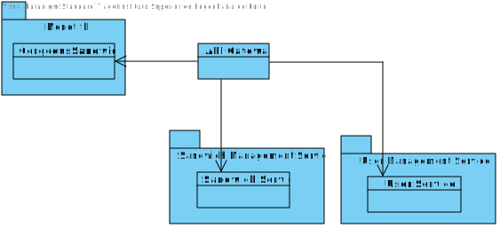

# Part 2

### DDD

### Technologies to use

#### SpringBoot

Spring Boot is an open source Java-based framework that adheres to the inversion of control programming principle and is oriented towards the development of web based applications. It is a popular framework for developing microservices. The usage of this techonology was an imposed requirement.

#### .Net

.Net is an open source that supports multiple languages, C# among them. It is a popular framework for developing microservices. This technology was chosen due to the group's familiarity with it.

#### JUnit

Unit tests should be implemented in the project, as a result a testing framework should be used. Since the group is familiar with JUnit, and it's the most used Java testing framework it was established that it is the framework that should be used in this project.

#### Postman

Since the application will have no frontend a tool to send requests to the app either for demonstration or for testing purposes is required. Since the group is familiarized with Postman and since it is a tool that makes available a testing framework for free, it was chosen to implement system tests.

#### Sonargraph

Sonargraph is a powerful static code analyzer that allows you to monitor a software system for technical quality and enforce rules regarding software architecture, metrics and other aspects in all stages of the development process (https://www.hello2morrow.com/products/sonargraph). The usage of this techonolgy was an imposed requirement.

#### PostgreSQL

PostgreSQL was used in the previous monolith application and there is no reason to not mantain it's usage.

#### MsSQL

.Net was developed by the microsoft foundation and as such it has a good integration with MsSQL which was also microsoft's property.

#### Technology 8 (If necessary in retrospect)

### Drivers

#### Use Cases

| Use Case                                           | Description                                                  | Assigned to:        |
| -------------------------------------------------- | ------------------------------------------------------------ | ------------------- |
| UC2 - Create an order.                             | A costumer must be able to register sandwiches and their quantities to deliver on a specific day, on a specific shop. A sandwich can never be sold below zero and the promotions used should be possible to  be changed within seconds without afecting what was selected. Also promotions are reflected in the price according to diferent possibilities: only the most favourable or local and global promotions are applied cumulatively. | Tiago               |
| UC7 - List orders.                                 | List all orders.                                             | Rui                 |
| UC8 - Change promotion possibility.                | The application should allow the admin to change the way promotions are applied. Only the most favourable or local and global promotions are applied cumulatively. | Tiago and Vera      |
| UC17 - Generate monthly reports for placed orders. | Generate monthly reports for placed orders.                  | -                   |
| UC18 - Refine shop.                                | Implement shop update. Add constraint attributes:   Minimum acceptable advance, maximum number of deliveries, period | Rui                 |
| UC19 - Refine order.                               | Implement an algorithm to automatically schedule the order depending on the shop's constraints. | Tiago and Alexandre |
| UC20 - (Refine) List deliveries by shop.           | List all the orders of a given shop.                         | Rui                   |
| UC21 - Mark delivery as completed.                 | A shop manager must be able to mark a delivery as completed. | Rui                   |

#### Quality Attributes

| ID    | Quality Attribute | Scenario                                                                                                      | Associated use case                                  | 
|-------|-------------------|---------------------------------------------------------------------------------------------------------------|------------------------------------------------------|
| QA-1  | Modifiability     | The application must remain easy to modify.                                                                   | All use cases.                                       |
| QA-2  | Usability         | The application should be accessible using an HTTP protocol.                                                  | All use cases.                                       |
| QA-3  | Performance       | The project should be 100% available to use.                                                                  | All use cases.                                       |
| QA-4  | Testability       | All funcionalities should be tested.                                                                          | All use cases.                                       |
| QA-5  | Security          | Functionalities should protect against SQL injection attacks and Denial of Service.                           | UC-2; UC-7; UC-8; UC-17; UC-18; UC-19; UC-20; UC-21. |
| QA-6  | Maintainability   | Maintability metrics should be used to improve the codebase.                                                  | All use cases.                                       |
| QA-7  | Usability         | The promotion possibility should be auto-detected.                                                            | UC-8.                                                |
| QA-8  | Usability         | The order queue should be handled automatically.                                                              | UC-19.                                               |
| QA-9  | Discoverability   | Discoverability of new service instances is to be demonstrated.                                               | All use cases.                                       |
| QA-10 | Modifiability     | Direct dependencies in the database are to be eliminated depending on the adopted data management strategies. | All use cases.                                       |

#### Constraints

| ID     | Constraint                                                                                 |
|--------|--------------------------------------------------------------------------------------------|
| CON-1  | The prototype to be developed must be accessible using a web browser.                      |
| CON-2  | Use of Java Spring.                                                                        |
| CON-3  | Use of open-source software.                                                               |
| CON-4  | The prototype should be available in the next four weeks (Deadline is 23th December 2022). |
| CON-5  | Use of the Sonargraph-Explorer.                                                            |
| CON-6  | Testing is mandatory for the prototype.                                                    |
| CON-7  | Use of Database (PostgreSQL and MSSql Server).                                             |
| CON-8  | Use of more than one language in microservices (C# and Java).                              |
| CON-9  | The use of GraphQL is mandatory.                                                           |
| CON-10 | Previous functionalities must still be present.                                            |
| CON-11 | Microservice architecture is needed.                                                       |
| CON-12 | Deployment using containers.                                                               |
| CON-13 | Each service’s API must be documented using Swagger (OpenAPI).                             |
| CON-14 | Service Discovery is mandatory.                                                            |

#### Architectural concerns

| ID    | Concern                                                                                                       |
|-------|---------------------------------------------------------------------------------------------------------------|
| CRN-1 | Establishing an overall initial system structure.                                                             |
| CRN-2 | Leverage the team’s knowledge about C# and Java technologies, including Spring and about PostgreSQL database. |
| CRN-3 | Allocate work to members of the development team.                                                             |
| CRN-4 | Input Validation.                                                                                             |

### ADD

#### Iteration 1

#### Step 1

| Scenario ID | Importance to the customer | Dificulty of implementation |
|-------------|----------------------------|-----------------------------|
| QA-1        | Medium                     | Medium                      |
| QA-2        | High                       | Low                         |
| QA-3        | High                       | Medium                      |
| QA-4        | Medium                     | High                        |
| QA-5        | Medium                     | High                        |
| QA-6        | Low                        | Medium                      |
| QA-7        | High                       | Medium                      |
| QA-8        | High                       | High                        |
| QA-9        | Medium                     | Medium                      |
| QA-9        | Medium                     | Medium                      |

| Category                        | Details                                                                                                                                                                                                                                             |
|---------------------------------|-----------------------------------------------------------------------------------------------------------------------------------------------------------------------------------------------------------------------------------------------------|
| Design purpose                  | A greenfield system from a mature domain is to be developed and it is necessary to produce a sufficiently detailed design to support the construction of the system.                                                                                |
| Primary functional requirements | From all use cases presented, the primary ones are: UC2- Create an Order, UC7- List orders, UC8- Change promotion possibility, UC18 - Refine shop, UC19 - Refine order, UC20 - (Refine) List deliveries by shop, UC21 - Mark delivery as completed. |
| Quality Attribute scenarios     | QA-1, QA-2, QA-4, QA-5, QA-6, QA-7, QA-8, QA-9, QA-10.                                                                                                                                                                                              |
| Constraints                     | All of the constraints previously presented are included as drivers.                                                                                                                                                                                |
| Architectural concerns          | All of the architectural concerns previously presented are included as drivers.                                                                                                                                                                     |

#### Step 2

Goal: Identification of all the bounded contexts for the project.

#### Step 3

Refine the system's domain.

#### Step 4

In order to achieve a microservices' architecture, the team need to analyse the project developed and the domain of the project done for the first part of the work. The team will:

- apply DDD patterns;
- identify all the bounded contexts and its iteractions between others.

In this migration to microservices the team decided to: **Decompose by business capability and by subdomain along with other design principles**

Bouded Contexts identified:

- SandwichManagementContext;
- ShopManagementContext;
- PromotionManagementContext;
- UserManagementContext;
- OrderManagementContext;

The group decided that the ideal pattern is an Open Host Service (OHS) with a Published Language (PL).

## SandwichesManagementContext

The sandwiches context consumed by shop and order contexts. Sandwiches context doesn't consume any context.

## ShopManagementContext

The shop context consumes order, user and sandwich context. Shop context is consumed by order, promotion and user context.

## PromotionManagementContext

Promotion context consumes sandwich and shop context and is consumed by order context.

## UserManagementContext

The user context consumes shop. User context is consumed by order and shop context.

## OrderManagementContext

Orders context consumes user, shop, sandwich and promotion contexts. Orders context is consumed by shop context.

#### Step 5 and 6

Instantiate architectural elements and sketch them:

Bounded Contexts in more detail:

| Bounded Context             | Responsabilities                                      | Entities related                       |
|-----------------------------|-------------------------------------------------------|----------------------------------------|
| SandwichesManagementContext | Responsible for creating and obtaining the sandwiches | Sandwich                               |
| ShopManagementContext       | Responsible for creating and obtaining the shops      | Shop, User, Sandwich, Order            |
| PromotionManagementContext  | Responsible for creating and obtaining the promotion  | Promotion, Shop, Sandwiches            |
| UserManagementContext       | Responsible for creating and obtaining the users      | User                                   |
| OrderManagementContext      | Responsible for creating and obtaining the orders     | User, Order, Sandwich, Shop, Promotion |

Context Map created (using the tool of Context Mapper):

#### Step 7

| Not addressed | Partially addressed | Addressed | Design Decisions made during the Iteration                                                                                                                                |
|:-------------:|:-------------------:|:---------:|:--------------------------------------------------------------------------------------------------------------------------------------------------------------------------|
|               |                     |    UC2    | Fully addressed in previous ADD.                                                                                                                                          |
|               |                     |    UC7    | Fully addressed in previous ADD.                                                                                                                                          |
|               |                     |    UC8    | Fully addressed in previous ADD.                                                                                                                                          |
|     UC17      |                     |           | No relevant decisions made.                                                                                                                                               |
|               |                     |   UC18    | The design decisions will be equal to the UC2.                                                                                                                            |
|     UC19      |                     |           | No relevant decisions made.                                                                                                                                               |
|               |                     |   UC20    | The design decisions will be equal to the UC7.                                                                                                                            |
|     UC21      |                     |           | No relevant decisions made.                                                                                                                                               |
|               |                     |   QA-1    | Fully addressed in previous ADD.                                                                                                                                          |
|               |                     |   QA-2    | Fully addressed in previous ADD.                                                                                                                                          |
|               |        QA-4         |           | Unit and System Tests will be handled as in the previous ADD.                                                                                                             |
|               |        QA-5         |           | SQL injection has been documented in the previous ADD, leaving the denial of service to be implemented.                                                                   |
|               |                     |   QA-6    | Documented in the previous ADD and will be applied to all microservices instead of the monolithic app.                                                                    |
|               |                     |   QA-7    | Documented in the previous ADD.                                                                                                                                           |
|     QA-8      |                     |           | No relevant decisions made.                                                                                                                                               |
|     QA-9      |                     |           | No relevant decisions made.                                                                                                                                               |
|     QA-10     |                     |           | No relevant decisions made.                                                                                                                                               |
|               |                     |   CON-1   | With the chosen technologies to develop this system, the prototype can only be accessed via web browser.                                                                  |
|               |                     |   CON-2   | The technology was imposed by the client.                                                                                                                                 |
|               |                     |   CON-3   | The team ran a study on the available technologies to develop the intended software.                                                                                      |
|               |                     |   CON-4   | All team members are aware of the deadline.                                                                                                                               |
|               |                     |   CON-5   | Technologies that have been considered up to this point take into account the knowledge of the developers. Sonargraph-Explorer was selected as the technology to be used. |
|               |        CON-6        |           | The same technologies will be used as in the previous ADD iteration. Aditionally to (XXX TECHNOLOGY TO BE USED) for contract testing                                      |
|               |        CON-7        |           | Technologies that have been considered up to this point take into account the knowledge of the developers. PostgreSQL and MSSQL were selected as the databases.           |
|               |                     |   CON-8   | The technology was chosen due to the group's familiarity with it.                                                                                                         |
|               |        CON-9        |           | The technology was imposed by the client.                                                                                                                                 |
|               |       CON-10        |           | Previous functionalities will be moved to their corresponding microservice.                                                                                               |
|               |                     |  CON-11   | The technology was imposed by the client.                                                                                                                                 |
|    CON-12     |                     |           | No relevant decisions made.                                                                                                                                               |
|    CON-13     |                     |           | No relevant decisions made.                                                                                                                                               |
|    CON-14     |                     |           | No relevant decisions made.                                                                                                                                               |
|               |                     |   CRN-1   | Architecure documented in previous ADD and the new microservices architecture is detailed on the context map.                                                             |
|               |                     |   CRN-2   | Technologies were addressed in the previous ADD and the new ones are explained in the Technologies to use section.                                                        |
|               |                     |   CRN-3   | The work was equaly divided by the gorup, each element was in charge of implementing atleast one microservice.                                                            |
|               |                     |   CRN-4   | Modules across the layers to support this use case have been identified like in the previous ADD.                                                                         |

#### Iteration 2

#### Step 2

The goal is to identify all the microservices from the bounded contexts.

#### Step 3

The element is the system.

#### Step 4

The system will be defined into Bounded Contexts each of those corresponding to a microservice.

Each microservice should be small and isolated enough so that altering one will not require altering another, still, microservices that are too small and do only non-complex operations should be avoided as well in order to prevent affecting the performance the system and therefore diminuishing the quality of the product.

An additional requirement of the system is the consistency of the data across the system, therefore eventual consistency should be guaranteed.

Since service discovery is required by Constraint 14, we've decided to implement service registry service, which is a frequently used pattern in this type of architectures, named _Server Side Discovery_.

With this pattern, clients communicate with the Load Balancer, which makes requests to the service registry in order to get services' location. After that it will make a decision, based on an algorithm, on which service should it request, working as a reverse proxy.

To promote decoupling, microservices will have their own databases. This will prevent each database from affecting the others.

Considering that the API Gateway is working as a reverse proxy, it is going to retrieve resources as a client from one or more microservices, and it can also aggregate data, which is another pattern, named _API Composition_.

Based on the previously defined Bounded Contexts and the decisions explained above, these are the microservices we identified:

| Micro Service               | Responsibilities                                                                         |
|:----------------------------|:-----------------------------------------------------------------------------------------|
| SandwichesManagementService | **Functionalities** associated with the SandwichesManagementContext.                     |
| ShopManagementService       | **Functionalities** associated with the ShopManagementContext.                           |
| PromotionManagementService  | **Functionalities** associated with the PromotionManagementContext.                      |
| UserManagementService       | **Functionalities** associated with the UserManagementContext.                           |
| OrderManagementService      | **Functionalities** associated with the OrderManagementContext.                          |
| API Gateway / Load Balancer | Load-balancing and API Composition.                                                      |
| Service Registry            | Service discovery. Determines the network location of services based on application ids. |

#### Step 5 and 6

The fo llowing diagram displays a high-level view of the services and how they interact with each other.

Services' REST APIs are implied, in order to make the diagram understandable. Each microservice is consumed via a REST API.

The databases represented are using PostgreSQL in exception to OrderManagementService which will instead use MsSql Server. Several instances of the same service are going to share the database.

#### Step 7

| Not addressed | Partially addressed | Addressed | Design Decisions made during the Iteration                                                                                   |
|:-------------:|:-------------------:|:---------:|:-----------------------------------------------------------------------------------------------------------------------------|
|               |                     |    UC2    | No relevant decisions made.                                                                                                  |
|               |                     |    UC7    | No relevant decisions made.                                                                                                  |
|               |                     |    UC8    | No relevant decisions made.                                                                                                  |
|     UC17      |                     |           | No relevant decisions made.                                                                                                  |
|               |                     |   UC18    | No relevant decisions made.                                                                                                  |
|     UC19      |                     |           | No relevant decisions made.                                                                                                  |
|               |                     |   UC20    | No relevant decisions made.                                                                                                  |
|     UC21      |                     |           | No relevant decisions made.                                                                                                  |
|               |                     |   QA-1    | No relevant decisions made.                                                                                                  |
|               |                     |   QA-2    | No relevant decisions made.                                                                                                  |
|               |        QA-4         |           | No relevant decisions made.                                                                                                  |
|               |        QA-5         |           | No relevant decisions made.                                                                                                  |
|               |                     |   QA-6    | No relevant decisions made.                                                                                                  |
|               |                     |   QA-7    | No relevant decisions made.                                                                                                  |
|     QA-8      |                     |           | No relevant decisions made.                                                                                                  |
|               |        QA-9         |           | The multiple services and their interactions have been designed in the architecture diagram.                                 |
|     QA-10     |                     |           | No relevant decisions made.                                                                                                  |
|               |                     |   CON-1   | No relevant decisions made.                                                                                                  |
|               |                     |   CON-2   | No relevant decisions made.                                                                                                  |
|               |                     |   CON-3   | No relevant decisions made.                                                                                                  |
|               |                     |   CON-4   | No relevant decisions made.                                                                                                  |
|               |                     |   CON-5   | No relevant decisions made.                                                                                                  |
|               |        CON-6        |           | No relevant decisions made.                                                                                                  |
|               |                     |   CON-7   | The databases were chosen to promote decoupling.                                                                             |
|               |                     |   CON-8   | No relevant decisions made.                                                                                                  |
|               |        CON-9        |           | No relevant decisions made.                                                                                                  |
|               |                     |  CON-10   | Previous functionalities will be moved to their corresponding microservice.                                                  |
|               |                     |  CON-11   | No relevant decisions made.                                                                                                  |
|               |                     |  CON-12   | A docker container will be used to contain the system and initialize all the necessary services and respective dependencies. |
|    CON-13     |                     |           | No relevant decisions made.                                                                                                  |
|               |       CON-14        |           | Through the architecture diagram it is possible to do a initial design of the difference services needed.                    |
|               |                     |   CRN-1   | No relevant decisions made.                                                                                                  |
|               |                     |   CRN-2   | No relevant decisions made.                                                                                                  |
|               |                     |   CRN-3   | No relevant decisions made.                                                                                                  |
|               |                     |   CRN-4   | No relevant decisions made.                                                                                                  |

#### Iteration 3

#### Step 2 

The goal is to research and identify the technologies and patterns that will be used to implement and design the new architecture.

#### Step 3 

The element is all the microservices identified in the Iteration 2.

#### Step 4

Research was performed concerning _Microservice Design Patterns_, _Service Discovery_ and possible technologies to use when implementing said design patterns.

#### Design Patterns of Microservices
* API Gateway - An API Gateway acts as the entry point for requests coming from clients. Instead of the resquests being sent to the services directly, the clients call the API Gateway and instead and the requests are in turn redirected to the corresponding microservice. This design decouples clients from the services and allows for the implementation of additional protection mechanisms in the system.
* Asynchronous Messaging: In order to preserve _Eventual Consistency_ some services need to communicate with each other, this communication happens asynchronously

#### Service Discovery in a Microservices Architecture

Main service discovery patterns [1]:
* Client-side discovery - The client is responsible for determining the network locations of available service instances and load balancing requests across them. The client is responsible for querying the service registry. Afterwards the client uses a load-balancing algorithm in order to select one of the available service instances and performs a request to the selected one.
  * Example: Netflix OSS: Netflix Eureka is a service registry, it provides a REST API that manages service instance registration.
  * Client-side discovery has the benefit of knowing about the available service instances, still this has the drawback of closely coupling the client with the service registry.
* Server-side discovery - The client makes a request to the service via a load-balancer. The load-balancer then queries the service registry and in turn routes the requests to an available service instance.
  * Example: AWS Elastic Load Balancer: AWS Elastic Load Balancer is a server-side discovery router. It is normally used to load balance external trafficn.
  * Example: NGINX Plus/ NGIX can be used as server-side discovery load balancers, utilizing support tools like Consul Template to dinamically reconfigure NGINX reverse proxying.
  * Server-side discovery is simpler in terms of client-side code, yet it's more complex in terms of deployment since the deployment environment must be configured to do so.

#### Step 5 and 6

| Design Decisions and Location           | Rationale                                                                                                                                                                                                                                                                                                                                                                                                                                       |
|-----------------------------------------|-------------------------------------------------------------------------------------------------------------------------------------------------------------------------------------------------------------------------------------------------------------------------------------------------------------------------------------------------------------------------------------------------------------------------------------------------|
| Netflix Eureka as the Service Discovery | The service registry is a database containing the network locations of the service instances. This service registry need to be highly available and up to date and consists of a cluster of servers using a replication protocol to mantain consistency. Netflix eureka will be used as the service registry since it provied a simple REST API for registering and querying the service instances. It also enables server-side load balancing. |
| Spring Cloud Gateway as the API Gateway | Spring Cloud Gateway aims to provide a simple, yet effective way to route to APIs and provide cross-cutting concerns to them such as: security, monitoring/metrics, and resiliency. It provides a library for building an API Gateway, which can be built on Spring Boot (as utilized in the prototype).                                                                                                                                        |

#### Implementation for Microservices

Researching service discovery led the group to Netflix Eureka due to its popularity. An example guide for Spring Boot may be observed in [2].

##### Spring Cloud Gateway

Spring Cloud Gateway aims to provide a simple, yet effective way to route to APIs and provide cross-cutting concerns to them such as: security, monitoring/metrics, and resiliency. It provides a library for building an API Gateway, which can be built on Spring Boot (the one used in the prototype).

##### Netflix Eureka

The Eureka is a RESTful service from the netflix that is mainly used as a service discovery on Server or/and Client side, load balancing and failover of middle-tier servers.

##### OpenAPI (Swagger)

Since openAPI documentation is mandatory (CON-13) a Swagger library will be used to generate it in each of the microservices. will also be used in the implementation of the microservices. Swagger was chosen due to the group's members familiarity with the tool.

#### Step 7

| Not addressed | Partially addressed | Addressed | Design Decisions made during the Iteration                                                    |
|:-------------:|:-------------------:|:---------:|:----------------------------------------------------------------------------------------------|
|               |                     |    UC2    | No relevant decisions made.                                                                   |
|               |                     |    UC7    | No relevant decisions made.                                                                   |
|               |                     |    UC8    | No relevant decisions made.                                                                   |
|     UC17      |                     |           | No relevant decisions made.                                                                   |
|               |                     |   UC18    | No relevant decisions made.                                                                   |
|     UC19      |                     |           | No relevant decisions made.                                                                   |
|               |                     |   UC20    | No relevant decisions made.                                                                   |
|     UC21      |                     |           | No relevant decisions made.                                                                   |
|               |                     |   QA-1    | No relevant decisions made.                                                                   |
|               |                     |   QA-2    | No relevant decisions made.                                                                   |
|               |        QA-4         |           | No relevant decisions made.                                                                   |
|               |        QA-5         |           | No relevant decisions made.                                                                   |
|               |                     |   QA-6    | No relevant decisions made.                                                                   |
|               |                     |   QA-7    | No relevant decisions made.                                                                   |
|               |        QA-8         |           | No relevant decisions made.                                                                   |
|               |                     |   QA-9    | Selected reference architecture establishes the modules that will support this functionality. |
|               |        QA-10        |           | Selected reference architecture establishes the modules that will support this functionality. |
|               |                     |   CON-1   | No relevant decisions made.                                                                   |
|               |                     |   CON-2   | No relevant decisions made.                                                                   |
|               |                     |   CON-3   | No relevant decisions made.                                                                   |
|               |                     |   CON-4   | No relevant decisions made.                                                                   |
|               |                     |   CON-5   | No relevant decisions made.                                                                   |
|               |        CON-6        |           | No relevant decisions made.                                                                   |
|               |                     |   CON-7   | No relevant decisions made.                                                                   |
|               |                     |   CON-8   | No relevant decisions made.                                                                   |
|               |        CON-9        |           | No relevant decisions made.                                                                   |
|               |                     |  CON-10   | No relevant decisions made.                                                                   |
|               |                     |  CON-11   | No relevant decisions made.                                                                   |
|               |                     |  CON-12   | No relevant decisions made.                                                                   |
|               |                     |  CON-13   | The technology was explored by the team.                                                      |
|               |                     |  CON-14   | Selected reference architecture establishes the modules that will support this functionality. |
|               |                     |   CRN-1   | No relevant decisions made.                                                                   |
|               |                     |   CRN-2   | No relevant decisions made.                                                                   |
|               |                     |   CRN-3   | No relevant decisions made.                                                                   |
|               |                     |   CRN-4   | No relevant decisions made.                                                                   |

### References

[1]https://www.nginx.com/blog/service-discovery-in-a-microservices-architecture/

[2]https://www.baeldung.com/spring-cloud-netflix-eureka

#### Iteration 4

#### Step 2

The goal is to identify the migration patterns to be used.

#### Step 3

The element is the migrating the system consists in migrating all the microservices identified previously.

#### Step 4

The application will be divided into microservices as requested in the project statement. This brings a number of advantages:
* Smaller and faster deployment - Smaller codebase and smaller scope is translated into faster deployments;
* Elimination of vendor/technology lock-in - Since a system uses multiple isolated microservices, a new technology or vendor may be applied with considerably more ease into an individual service as needed.
* Improved fault isolation - The failure of a microservice will most of the time only affect said microservice.
* Lowered coupling - Due to the decentralized nature of microservice architecture rolling back any changes or altering existing services becomes easier.
* Scalability - The decentralization also allow more flexibility in terms of scalibility, allowing for the expansion of any one service as needed rather than the whole application.

Some migration patterns were considered:
* Parallel Full Redesign - consists in a full redesign, creating the microservice architecture from scratch. The monolithic legacy application would remain unchanged and the new system would be developed in parallel following microservice architecture patterns. Unfortunatelly this has the disadvantage of leading to waterfall development.
* Strangler Fig - consists in incrementally replacing the existing functionalities of the monolithic legacy application, until it reaches a point where the monolithic app has been fully replaced with the microservices [2]. This strategy follows the following steps:
    1. Identification of the application's bounded contexts.
    2. Choose the bounded context that is the least costly to refactor.
    3. Design the microservice.
    4. Implement said microservice.

With both patterns considered the group decided to apply Strangler Fig, although it has the drawback that both the new system and legacy system need to function simultaneously and to be integrated.

#### Step 5 and 6

The microservices were ranked, from smallest/least complex to largest/most complex, as follows:

- SandwichesManagementService
- UserManagementService
- PromotionManagementService
- ShopManagementService
- OrderManagementService

The first service to be converted into a microservice is the SandwichesManagementService, as it is the least complex and smallest of them all.

In the second iteration, the UserManagementService is migrated.

In the third iteration, the PromotionManagementService is migrated.

In the fourth iteration, the ShopManagementService is migrated.

In the fifth iteration, the OrderManagementService is migrated.

With this process the application was "strangled", in other words it was periodically transformed from a monolithic application to individual microservices. After all six iterations the migration progress is finished.

#### Step 7

| Not addressed | Partially addressed | Addressed | Design Decisions made during the Iteration                                                    |
|:-------------:|:-------------------:|:---------:|:----------------------------------------------------------------------------------------------|
|               |                     |    UC2    | No relevant decisions made.                                                                   |
|               |                     |    UC7    | No relevant decisions made.                                                                   |
|               |                     |    UC8    | No relevant decisions made.                                                                   |
|     UC17      |                     |           | No relevant decisions made.                                                                   |
|               |                     |   UC18    | No relevant decisions made.                                                                   |
|     UC19      |                     |           | No relevant decisions made.                                                                   |
|               |                     |   UC20    | No relevant decisions made.                                                                   |
|     UC21      |                     |           | No relevant decisions made.                                                                   |
|               |                     |   QA-1    | No relevant decisions made.                                                                   |
|               |                     |   QA-2    | No relevant decisions made.                                                                   |
|               |        QA-4         |           | No relevant decisions made.                                                                   |
|               |        QA-5         |           | No relevant decisions made.                                                                   |
|               |                     |   QA-6    | No relevant decisions made.                                                                   |
|               |                     |   QA-7    | No relevant decisions made.                                                                   |
|               |        QA-8         |           | No relevant decisions made.                                                                   |
|               |                     |   QA-9    | No relevant decisions made.                                                                   |
|               |                     |   QA-10   | Selected reference architecture establishes the modules that will support this functionality. |
|               |                     |   CON-1   | No relevant decisions made.                                                                   |
|               |                     |   CON-2   | No relevant decisions made.                                                                   |
|               |                     |   CON-3   | No relevant decisions made.                                                                   |
|               |                     |   CON-4   | No relevant decisions made.                                                                   |
|               |                     |   CON-5   | No relevant decisions made.                                                                   |
|               |        CON-6        |           | No relevant decisions made.                                                                   |
|               |                     |   CON-7   | No relevant decisions made.                                                                   |
|               |                     |   CON-8   | No relevant decisions made.                                                                   |
|               |                     |   CON-9   | No relevant decisions made.                                                                   |
|               |                     |  CON-10   | No relevant decisions made.                                                                   |
|               |                     |  CON-11   | No relevant decisions made.                                                                   |
|               |                     |  CON-12   | No relevant decisions made.                                                                   |
|               |                     |  CON-13   | No relevant decisions made.                                                                   |
|               |                     |  CON-14   | No relevant decisions made.                                                                   |
|               |                     |   CRN-1   | No relevant decisions made.                                                                   |
|               |                     |   CRN-2   | No relevant decisions made.                                                                   |
|               |                     |   CRN-3   | No relevant decisions made.                                                                   |
|               |                     |   CRN-4   | No relevant decisions made.                                                                   |

### References

[1]https://cloudacademy.com/blog/microservices-architecture-challenge-advantage-drawback/
[2]https://dianadarie.medium.com/the-strangler-fig-migration-pattern-2e20a7350511

#### Iteration 5

#### Step 2

Research new languages to utilize; the impact and advantages of using the GraphQL technology; study NoSQL and Denial of Services attacks and how to protect the application against them.

#### Step 3

CON-8 and CON-9: using GraphQL. QA-5: All use cases.

#### Step 4

**CON-8: The use of more than one language for different microservices is mandatory**

Using different languages across multiple microservices can be beneficial in a number of ways, namely:

- Providing the tools necessary for a specific microservice is easier when multiple languages are available to choose from. Therefore, restricting every microservice to a single language can limit certain functionalities;
- In a team working environment, certain developers may have greater knowledge working with specific languages. If every team member is assigned a different microservice to work with, they may choose to work with the language they are most comfortable with. This leads to a greater quality of the code since every team member is working in their preferred language.

However, there are certainly disadvantages to using more than one language in a microservice application. For example:

- The ability to reuse code across microservices is extremely limited if multiple languages are used. Therefore, this can mean that the same functionality might have to be implemented from scratch multiple times;
- Understanding the entire application is made more difficult the more languages are used. Trying to explain certain functionalities can also be harder if each microservice changes considerably from one another.

In order to comply to CON-8, we studied different languages and decided to use Java and C#. We chose Java because most of our application was previously developed using the Java Spring technology. In order to minimize the time needed to migrate every functionality into a microservice, we decided to keep some microservices in the Java language.
The other language we chose was C#, and we decided to use it because of how familiar our team is with it. There are also numerous advantages to using C# in a microservices application, like:

- the vast documentation available to better understand it;
- available libraries that minimize the amount of time needed to develop certain functionalities;
- compatibility with most libraries and technologies like, for example, GraphQL.

**CON-9: The use of GraphQL is mandatory**

Created by Facebook, GraphQL is a query language designed to make API requests faster and simpler. The main advantages to using this technology are as follows:

- Applications that use GraphQL can control the data that they get, in contrast to relying on a server. This makes it so that these applications are faster and more stable;
- The ability to get multiple resources from a single request. In contrast to a simple REST API, a GraphQL application can get various types of data at the same time with a single request;
- Modifiability is assured by simply by adding new parameters to existing queries;

In order to comply to CON-9 we had to consider how to implement GraphQL into our application and how doing so would impact it.
Adding GraphQL to our application would:

- Make it faster, since it wouldn't need to constantly send requests to the databases;
- Make it more reliable, since a GraphQL query only returns the information requested. This way, there can be no instance where unneeded information is presented to a user or simply poorly managed in the system;
- Improve and make easier the scalability of the application.

**QA-5: The project contains protection against Denial of Service and NoSQL injection**

Regarding QA-5, we studied various ways to better secure our system against NOSQL and DOS attacks. In order to implement this is in our application, we first conducted research regarding these type of attacks. We found that NOSQL attacks can be avoided by:

- treating all user input as untrusted. This means that we should always verify every input our users can send to our system;
- running our applications with the lowest privileges possibles. This way, if an attack were to succeed, the attacker would not be able to access other resources.

On the other hand, DOS attacks can be more complicated to protect from.
In order to protect our application against these types of attacks, in theory, we should:

- use anti-ddos hardware and software;
- know exactly the symptoms of a DOS attack, so we can better react if one occurs;
- scale up the bandwidth;
- develop a DOS response plan, so we know what to do if an attack does occur;
- limit network traffic to strictly necessary;
- run tests to simulate DOS attacks;
- monitor the network continually;
- apply a firewall. Because DOS attacks only come from one source and not multiple ones like in a DDOS attack, using a firewall can be very helpful to protect against them since it could easily detect where the attack was coming from and block any access from that source.

Since most of these measures would not be applicable to our application, we decided that the best way to protect against DOS attack would be to monitor the network continually, run tests to simulate DOS attacks and applying a proficient firewall.

#### Step 5 and 6

UC-21 - Mark delivery as completed

This UC was choosen to evidence connections with different MSs.

#### Step 7

| Not addressed | Partially addressed | Addressed | Design Decisions made during the Iteration                               |
|:-------------:|:-------------------:|:---------:|:-------------------------------------------------------------------------|
|               |                     |    UC2    | No relevant decisions made.                                              |
|               |                     |    UC7    | No relevant decisions made.                                              |
|               |                     |    UC8    | No relevant decisions made.                                              |
|               |                     |   UC17    | Modules across the layers to support this use case have been identified. |
|               |                     |   UC18    | No relevant decisions made.                                              |
|               |        UC19         |           | Modules across the layers to support this use case have been identified. |
|               |                     |   UC20    | No relevant decisions made.                                              |
|               |                     |   UC21    | Modules across the layers to support this use case have been identified. |
|               |                     |   QA-1    | No relevant decisions made.                                              |
|               |                     |   QA-2    | No relevant decisions made.                                              |
|               |        QA-4         |           | No relevant decisions made.                                              |
|               |                     |   QA-5    | .                                                                        |
|               |                     |   QA-6    | No relevant decisions made.                                              |
|               |                     |   QA-7    | No relevant decisions made.                                              |
|               |        QA-8         |           | No relevant decisions made.                                              |
|               |                     |   QA-9    | No relevant decisions made.                                              |
|               |                     |   QA-10   | No relevant decisions made.                                              |
|               |                     |   CON-1   | No relevant decisions made.                                              |
|               |                     |   CON-2   | No relevant decisions made.                                              |
|               |                     |   CON-3   | No relevant decisions made.                                              |
|               |                     |   CON-4   | No relevant decisions made.                                              |
|               |                     |   CON-5   | No relevant decisions made.                                              |
|               |        CON-6        |           | No relevant decisions made.                                              |
|               |                     |   CON-7   | No relevant decisions made.                                              |
|               |                     |   CON-8   | The team decided to use C# as the other language for the microservices.  |
|               |                     |   CON-9   | The use of GraphQL is mandatory and explained in the diagrams.           |
|               |                     |  CON-10   | No relevant decisions made.                                              |
|               |                     |  CON-11   | No relevant decisions made.                                              |
|               |                     |  CON-12   | No relevant decisions made.                                              |
|               |                     |  CON-13   | No relevant decisions made.                                              |
|               |                     |  CON-14   | No relevant decisions made.                                              |
|               |                     |   CRN-1   | No relevant decisions made.                                              |
|               |                     |   CRN-2   | No relevant decisions made.                                              |
|               |                     |   CRN-3   | No relevant decisions made.                                              |
|               |                     |   CRN-4   | No relevant decisions made.                                              |

#### Iteration 6

#### Step 2

The following system’s primary use case and quality attribute were considered:

- UC19, QA-8

#### Step 3

- UC19 - Refine order 
- QA-8: The order queue should be handled automatically.

#### Step 4

It was necessary to choose one approach to implement the UC19, of the next possible approaches:

* 1 - The order would go into an ordered queue and when previous orders would complete the next order in queue would go into "processing" state.

* 2 - The order will be automatically allocated in the system to the time and day that will be available to be processed.

We choose the second approach because:

- This approach would not force the system to have a service running constantly to move the orders to "processing".
- This approach would not need a new service to take care of the queue constantly.

#### Step 5 and 6

UC-19 Sequence Diagram - Refine order

#### Step 7

| Not addressed | Partially addressed | Addressed | Design Decisions made during the Iteration         |
|:-------------:|:-------------------:|:---------:|:---------------------------------------------------|
|               |                     |    UC2    | No relevant decisions made.                        |
|               |                     |    UC7    | No relevant decisions made.                        |
|               |                     |    UC8    | No relevant decisions made.                        |
|               |                     |   UC17    | No relevant decisions made.                        |
|               |                     |   UC18    | No relevant decisions made.                        |
|               |                     |   UC19    | Designs about the approach of the queue were made. |
|               |                     |   UC20    | No relevant decisions made.                        |
|               |                     |   UC21    | No relevant decisions made.                        |
|               |                     |   QA-1    | No relevant decisions made.                        |
|               |                     |   QA-2    | No relevant decisions made.                        |
|               |        QA-4         |           | No relevant decisions made.                        |
|               |                     |   QA-5    | No relevant decisions made.                        |
|               |                     |   QA-6    | No relevant decisions made.                        |
|               |                     |   QA-7    | No relevant decisions made.                        |
|               |                     |   QA-8    | Designs about the approach of the queue were made. |
|               |                     |   QA-9    | No relevant decisions made.                        |
|               |                     |   QA-10   | No relevant decisions made.                        |
|               |                     |   CON-1   | No relevant decisions made.                        |
|               |                     |   CON-2   | No relevant decisions made.                        |
|               |                     |   CON-3   | No relevant decisions made.                        |
|               |                     |   CON-4   | No relevant decisions made.                        |
|               |                     |   CON-5   | No relevant decisions made.                        |
|               |        CON-6        |           | No relevant decisions made.                        |
|               |                     |   CON-7   | No relevant decisions made.                        |
|               |                     |   CON-8   | No relevant decisions made.                        |
|               |                     |   CON-9   | No relevant decisions made.                        |
|               |                     |  CON-10   | No relevant decisions made.                        |
|               |                     |  CON-11   | No relevant decisions made.                        |
|               |                     |  CON-12   | No relevant decisions made.                        |
|               |                     |  CON-13   | No relevant decisions made.                        |
|               |                     |  CON-14   | No relevant decisions made.                        |
|               |                     |   CRN-1   | No relevant decisions made.                        |
|               |                     |   CRN-2   | No relevant decisions made.                        |
|               |                     |   CRN-3   | No relevant decisions made.                        |
|               |                     |   CRN-4   | No relevant decisions made.                        |

#### Iteration 7

#### Step 2

Adress the Quality Atributes and Constraints relative to the testability of the project.

#### Step 3

QA-4: All functionalities should be tested.
CON-6: Testing is mandatory for the prototype.

#### Step 4

| Design Decisions and Location    | Rationale and Assumptions                                                                                                                                                                                                                                                                                          |
|----------------------------------|--------------------------------------------------------------------------------------------------------------------------------------------------------------------------------------------------------------------------------------------------------------------------------------------------------------------|
| Use of unit tests for backend.   | A JUnit test is a method contained in a class which is only used for testing. This is called a Test class. This method executes the code under test. You use an assert method, provided by JUnit or another assert framework, to check an expected result versus the actual result. To support the QA-4 and CON-6. |
| Use of system tests for backend. | System testing is defined as testing of a complete and fully integrated software product. To support the QA-4 and CON-6.                                                                                                                                                                                           |
| Use of contract-based tests.     | Contracted based test is a methodology for ensuring that two separate systems (such as two microservices) are compatible and can communicate with one other. The techonoly to be used is Spring Cloud Contract. To support the QA-4 and CON-6.                                                                     |

#### Step 7

| Not addressed | Partially addressed | Addressed | Design Decisions made during the Iteration |
|:-------------:|:-------------------:|:---------:|:-------------------------------------------|
|               |                     |    UC2    | No relevant decisions made.                |
|               |                     |    UC7    | No relevant decisions made.                |
|               |                     |    UC8    | No relevant decisions made.                |
|               |                     |   UC17    | No relevant decisions made.                |
|               |                     |   UC18    | No relevant decisions made.                |
|               |                     |   UC19    | No relevant decisions made.                |
|               |                     |   UC20    | No relevant decisions made.                |
|               |                     |   UC21    | No relevant decisions made.                |
|               |                     |   QA-1    | No relevant decisions made.                |
|               |                     |   QA-2    | No relevant decisions made.                |
|               |                     |   QA-4    | Types of tests have been identified.       |
|               |                     |   QA-5    | No relevant decisions made.                |
|               |                     |   QA-6    | No relevant decisions made.                |
|               |                     |   QA-7    | No relevant decisions made.                |
|               |                     |   QA-8    | No relevant decisions made.                |
|               |                     |   QA-9    | No relevant decisions made.                |
|               |                     |   QA-10   | No relevant decisions made.                |
|               |                     |   CON-1   | No relevant decisions made.                |
|               |                     |   CON-2   | No relevant decisions made.                |
|               |                     |   CON-3   | No relevant decisions made.                |
|               |                     |   CON-4   | No relevant decisions made.                |
|               |                     |   CON-5   | No relevant decisions made.                |
|               |                     |   CON-6   | Types of tests have been identified.       |
|               |                     |   CON-7   | No relevant decisions made.                |
|               |                     |   CON-8   | No relevant decisions made.                |
|               |                     |   CON-9   | No relevant decisions made.                |
|               |                     |  CON-10   | No relevant decisions made.                |
|               |                     |  CON-11   | No relevant decisions made.                |
|               |                     |  CON-12   | No relevant decisions made.                |
|               |                     |  CON-13   | No relevant decisions made.                |
|               |                     |  CON-14   | No relevant decisions made.                |
|               |                     |   CRN-1   | No relevant decisions made.                |
|               |                     |   CRN-2   | No relevant decisions made.                |
|               |                     |   CRN-3   | No relevant decisions made.                |
|               |                     |   CRN-4   | No relevant decisions made.                |

### Maintainability Metrics

#### SonarGraph

The maintainability is above the required constraint (70%) for all microservices.

For sandwich microservice:

For user microservice:

For promotion microservice:

For shop microservice:

For order microservice:

### Work Division

| Task                                        | Assigned to                                                  |
| ------------------------------------------- | ------------------------------------------------------------ |
| Service Registration and Discovery (Eureka) | Setup - Alexandre and then everyone added the necessary information for their own microservice. |
| Gateway                                     | Setup - Alexandre and then everyone added the necessary information for their own microservice. |
| Containerization                            | Setup - Alexandre and then everyone added the necessary information for their own microservice. |
| Migrate Sandwich to Microservice            | Alexandre                                                    |
| Migrate User to Microservice                | Tiago                                                        |
| Migrate Promotion to Microservice           | Vera                                                         |
| Migrate Shop to Microservice                | Rui                                                          |
| Create/Migrate Order to Microservice        | Tiago                                                        |

### Tests

For the prototype the team decided to do unit tests for domain with JUnit and then for the system tests the team did tests on postman for requests.

## Prototype analysis

The prototype was developed with some objectives. Did it allow to understand the consequence of some decisions?

- The final form of the prototype consists in 7 different APIs that work together in order to make a functional application. The most important API is the Eureka. This service launches the Eureka server, which is essential for the system to work and recognize the others services. The second most important service is the Gateway. This service makes the connections between the microservices possible. All of the microservices developed in this project are then connected to the Gateway through the Registry. 5 microservices form the business rules of the application: PromotionManagement is related to promotions operations, OrderManagement is used to manage the orders, SandwichManagement controls sandwiches' operations, ShopService is used to manage the shop and UsersManagement controls users' operations.
- The final application is as close as the designed system as possible. It is possible to see the clear separation in microservices from the original prototype monolithic application, using the approached Strangler pattern. Each microservice has its own independent database now, instead of a single database for everything, which could've lead to problems in the future since the sensitive data wasn't separate. There's the use of more than one programming languages: Java and C#, as stated in CON-8 and GraphQL is implemented.
- The use cases, quality attributes, constraints and concerns were identified by dividing them into sections. In terms of quality attributes and constraints, these were defined throught what was imposed for the project by the professors. 
- All of the established use cases were fully developed, there are validations for the business logic, as well as unit, integration and automatic postman tests. This project allowed the team to understand the consequences of the decisions made during the design phase. In terms of modifiability, the prototype followed most of the expected requirements. In terms of security, the UsersManagement microservice has password encryption, JWT authentication and roles for the different operations.

### Files Info

- The tactic based questionaries are located in the folder Part 2
- The ADD readme file is located in the folder Part 2/Design